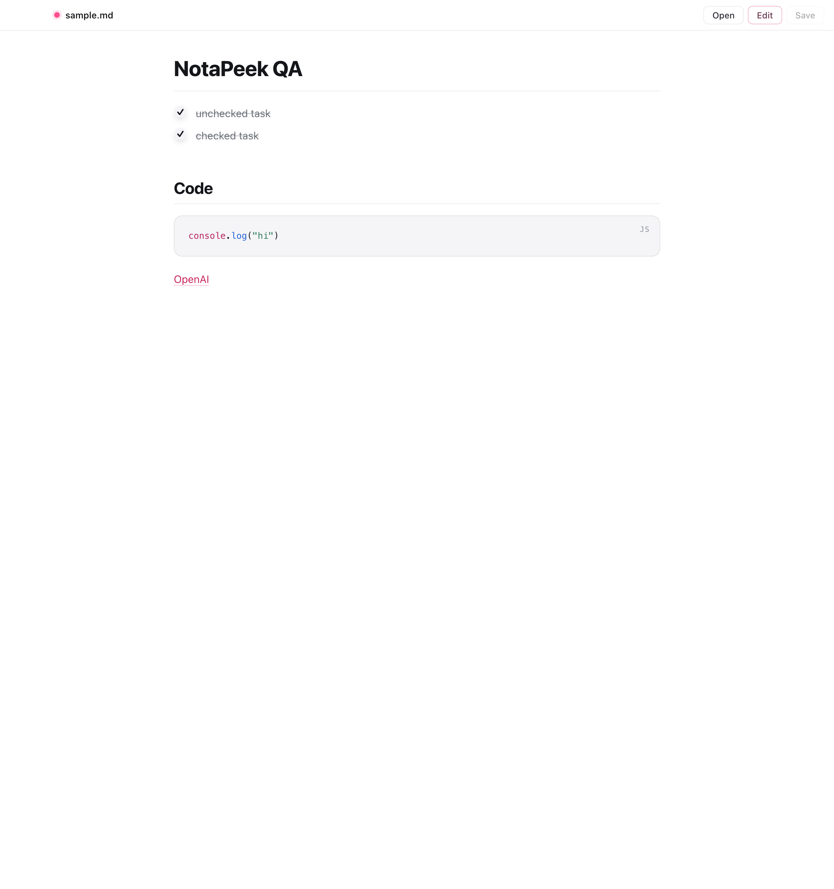

# NotaPeek

NotaPeek is a native macOS Markdown viewer/editor built with Tauri, React, and Swift Quick Look. It gives `.md` files a polished rendered preview in the app and in Finder.



## Features

- Open Markdown files from Finder, drag and drop, or the file picker.
- Switch between preview-only and split edit/preview mode.
- Save edits back to disk.
- Render GitHub-style Markdown, syntax-highlighted code blocks, and interactive task checkboxes.
- Install as a macOS app with `.md`, `.markdown`, `.mdown`, and `.mkd` file associations.
- Embed a Quick Look extension so Finder previews Markdown when pressing Space.

## Requirements

- macOS 12 or newer
- Bun
- Rust
- Xcode command line tools

## Development

```bash
bun install
bun run dev
```

Run the desktop app in development:

```bash
bun run tauri dev
```

Build the web frontend:

```bash
bun run build
```

## Package macOS App

Create a local macOS app bundle with the Quick Look extension embedded:

```bash
bun run package:mac
```

The app bundle is written to:

```text
src-tauri/target/release/bundle/macos/NotaPeek.app
```

By default, local packaging uses ad-hoc signing. For distribution signing, pass a Developer ID identity:

```bash
MACOS_SIGN_ID="Developer ID Application: Your Name (TEAMID)" bun run package:mac
```

Install or refresh the local app by replacing the old bundle, not by copying over it:

```bash
rm -rf /Applications/NotaPeek.app
ditto src-tauri/target/release/bundle/macos/NotaPeek.app /Applications/NotaPeek.app
open /Applications/NotaPeek.app
qlmanage -r && qlmanage -r cache
```

Do not use `cp -R ... /Applications/` over an existing app bundle. It can merge stale signed files with the new build and make the embedded Quick Look extension invalid.

If Finder still does not render Markdown previews, verify Spotlight is enabled. Quick Look and LaunchServices need it to resolve file types and register app extensions:

```bash
mdutil -s /
```

If the output says `Spotlight server is disabled`, re-enable Spotlight in System Settings or with administrator privileges, then reopen NotaPeek and reset Quick Look again.

## Release DMG

The release script builds, signs, packages, notarizes, and validates a distributable DMG:

```bash
MACOS_SIGN_ID="Developer ID Application: Your Name (TEAMID)" \
NOTARY_PROFILE="your-notary-profile" \
bun run release:dmg
```

Output:

```text
release/NotaPeek-1.0.4-arm64.dmg
```

## Project Structure

- `src/` - React app, Markdown rendering, editor behavior, and styles
- `src-tauri/` - Tauri shell, app metadata, icons, permissions, and Rust entrypoints
- `src-tauri/quicklook/` - Swift Quick Look extension source and preview assets
- `scripts/` - local packaging and release scripts

## License

Copyright Rachel noCode. All rights reserved.
